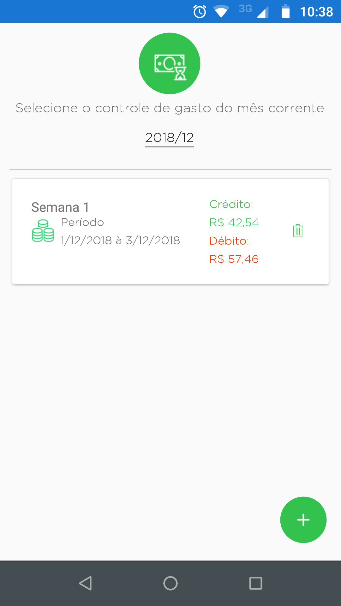
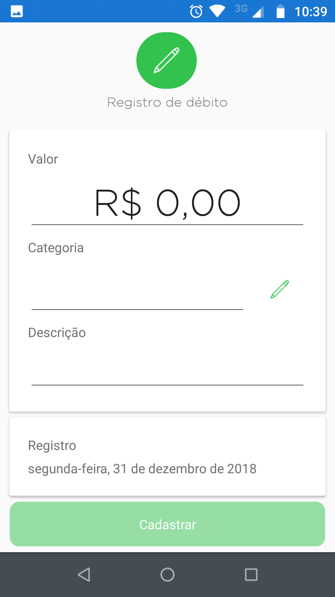
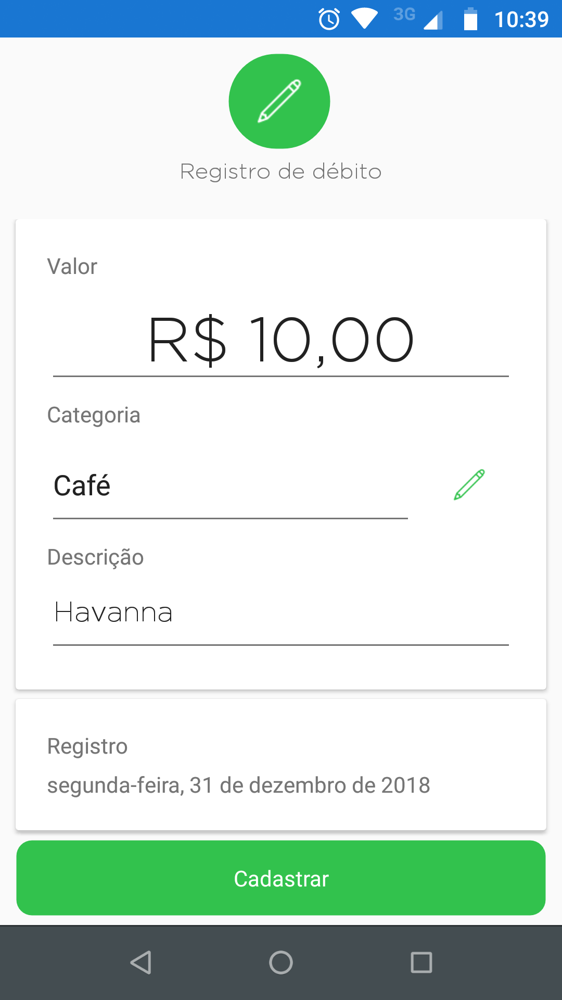
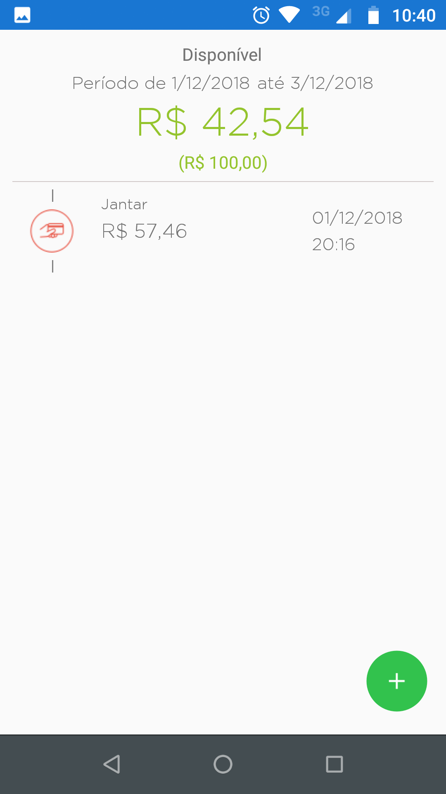

# Save Money
Bem vindo ao repositório do Save Money, aqui você vai encontrar todos os recursos necessários para construção do aplicativo mobile cross-plataforma utilizando Xamarin.Forms.

### Sobre o aplicativo
SaveMoney é um aplicativo para dispositivos móveis, multiplataforma, desenvolvido em Xamarin Forms. Ele tem como finalidade proporcionar o gerenciamento, de forma simples e direta, de gastos em um determinado período previamente configurado. 

### Sobre o código fonte
O aplicativo está funcionando bem, porém algumas melhorias ainda são necessárias. Estarei atualizando o código fonte, na medida do possível. Quer me ajudar? Faz um Fork ai!

#### Algumas telas

### Eu
Engenheiro de Software Especialista - VIRTUS/UFCG
Mestrado em Tecnologias Estratégicas em Saúde - UEPB/NUTES
Graduado em Sistemas de Informação - UNIFACISA
Certificação Internacional em Engenharia de Requisitos - 15-CPRE-FL-00109-BR
CPRE Insignia: https://www.ireb.org/en/service/cpre-registry-list/351/
Scrum Fundamentals Certifield Credential
